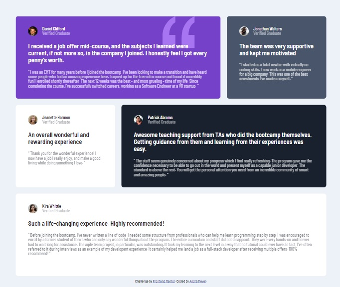

# Frontend Mentor - Interactive rating component solution

This is a solution to the [Testimonials grid section challenge on Frontend Mentor](https://www.frontendmentor.io/challenges/testimonials-grid-section-Nnw6J7Un7). Frontend Mentor challenges help you improve your coding skills by building realistic projects.

## Table of contents

- [Overview](#overview)
- [The challenge](#the-challenge)
- [Screenshot](#screenshot)
- [Links](#links)
- [Author](#author)

## Overview

### The challenge

Users should be able to:

- View the optimal layout for the site depending on their device's screen size

### Screenshot

 

### Links

- Solution URL: https://github.com/dev-andrewm/interactive-rating-component
- Live Site URL: https://dev-andrewm.github.io/interactive-rating-component/

## My process

### Built with

- Semantic HTML5 markup
- Grid-layout
- Mobile-first workflow

## Author

- Frontend Mentor - [@dev-andrewm](https://www.frontendmentor.io/profile/dev-andrewm)
- LinkedIn - [@meyer-andre](https://www.linkedin.com/in/meyer-andre)
